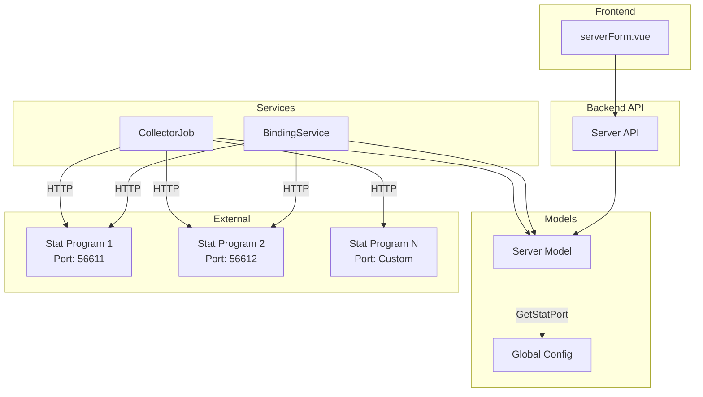

# Design Document: Server Stat Port

## Overview

本设计文档描述"统计服务端口"功能的技术实现方案。该功能允许每个代理服务器配置独立的统计服务端口，替代当前使用全局配置的方式。

核心设计原则：
- **向后兼容**: 当服务器未配置独立端口时，自动回退到全局配置
- **最小侵入**: 通过辅助方法封装端口获取逻辑，减少对现有代码的修改
- **单一职责**: Server 模型负责提供有效端口，调用方无需关心回退逻辑

## Architecture



## Components and Interfaces

### 1. Server Model Extension

**文件**: `gin-vue-admin/server/model/v2ray/server.go`

```go
type Server struct {
    // ... existing fields ...
    StatPort int `json:"stat_port" form:"stat_port" gorm:"column:stat_port;default:0"`
}

// GetStatPort 返回有效的统计服务端口
// 如果 StatPort > 0，返回 StatPort；否则返回全局配置
func (s *Server) GetStatPort() int {
    if s.StatPort > 0 {
        return s.StatPort
    }
    return global.GVA_CONFIG.STAT_PORT
}
```

### 2. BindingService Modification

**文件**: `gin-vue-admin/server/service/v2ray_admin/binding.go`

修改 `ReportBinding` 方法：

```go
func (bindingService *BindingService) ReportBinding(srv *v2ray.Server) error {
    // ... existing logic ...
    
    // 使用服务器的有效统计端口
    req.SetRequestURI(fmt.Sprintf("http://%s:%d/conf/update", srv.Ip, srv.GetStatPort()))
    
    // ... rest of the method ...
}
```

### 3. Traffic Collector Modification

**文件**: `gin-vue-admin/server/api/v1/job/traffic.go`

修改 `collectTraffic` 和 `collectSysInfo` 函数：

```go
func collectTraffic(srv *v2ray.Server, createdAt int) {
    // ... existing setup ...
    
    // 使用服务器的有效统计端口
    req.SetRequestURI(fmt.Sprintf("http://%s:%d/stat/traffic", srv.Ip, srv.GetStatPort()))
    
    // ... rest of the function ...
}

func collectSysInfo(srv *v2ray.Server) {
    // ... existing setup ...
    
    // 使用服务器的有效统计端口
    req.SetRequestURI(fmt.Sprintf("http://%s:%d/stat/sysinfo", srv.Ip, srv.GetStatPort()))
    
    // ... rest of the function ...
}
```

### 4. Frontend Form Extension

**文件**: `gin-vue-admin/web/src/view/v2ray_admin/server/serverForm.vue`

添加统计端口输入框：

```vue
<el-form-item label="统计端口:" prop="stat_port">
  <el-input 
    v-model.number="formData.stat_port" 
    :clearable="true" 
    placeholder="默认: 56611" 
  />
</el-form-item>
```

更新 formData 初始值：

```javascript
const formData = ref({
    ip: '',
    port: 80,
    remark: '',
    stat_port: 0,  // 新增字段
})
```

## Data Models

### Server Table Schema Change

| Column | Type | Default | Description |
|--------|------|---------|-------------|
| stat_port | INT | 0 | 统计服务端口，0 表示使用全局配置 |

### Migration Strategy

GORM AutoMigrate 会自动处理字段添加：

```go
// 在应用启动时，GORM 会自动添加缺失的列
db.AutoMigrate(&v2ray.Server{})
```

现有数据的 `stat_port` 列将默认为 0，系统会自动回退到全局配置。


## Correctness Properties

*A property is a characteristic or behavior that should hold true across all valid executions of a system—essentially, a formal statement about what the system should do. Properties serve as the bridge between human-readable specifications and machine-verifiable correctness guarantees.*

### Property 1: GetStatPort 端口回退逻辑

*For any* Server 实例，当 StatPort > 0 时，GetStatPort() 应返回 StatPort；当 StatPort <= 0 时，GetStatPort() 应返回 global.GVA_CONFIG.STAT_PORT。

**Validates: Requirements 1.2, 7.2, 7.3**

### Property 2: Server JSON 序列化 Round-Trip

*For any* 有效的 Server 实例，将其序列化为 JSON 后再反序列化，应得到等价的 Server 实例，且 stat_port 字段值保持一致。

**Validates: Requirements 1.3**

### Property 3: HTTP URI 端口一致性

*For any* Server 实例和任意 HTTP 端点路径，构建的 HTTP 请求 URI 中的端口应等于 Server.GetStatPort() 的返回值。

**Validates: Requirements 2.1, 2.3, 3.1, 3.3, 4.1, 4.3**

## Error Handling

### 端口值验证

- **无效端口范围**: 如果用户输入的端口超出有效范围 (1-65535)，前端应显示验证错误
- **端口冲突**: 系统不检测端口冲突，由运维人员确保端口可用

### HTTP 通信错误

- **连接失败**: 当无法连接到 stat 程序时，记录错误日志并继续处理其他服务器
- **超时**: 使用现有的 HTTP 客户端超时配置

### 数据库错误

- **迁移失败**: GORM AutoMigrate 失败时，应用启动失败并记录错误

## Testing Strategy

### 单元测试

1. **GetStatPort 方法测试**
   - 测试 StatPort > 0 时返回 StatPort
   - 测试 StatPort = 0 时返回全局配置
   - 测试 StatPort < 0 时返回全局配置（边界情况）

2. **JSON 序列化测试**
   - 测试 Server 结构体的 JSON 序列化/反序列化
   - 验证 stat_port 字段名正确

### 属性测试

使用 Go 的 `testing/quick` 包或 `gopter` 库进行属性测试：

1. **Property 1**: 生成随机 StatPort 值，验证 GetStatPort() 返回正确结果
2. **Property 2**: 生成随机 Server 实例，验证 JSON round-trip
3. **Property 3**: 生成随机 Server 和端点，验证 URI 构建正确

每个属性测试应运行至少 100 次迭代。

### 集成测试

1. **数据库迁移测试**: 验证 AutoMigrate 正确添加 stat_port 列
2. **API 测试**: 验证创建/更新服务器时 stat_port 字段正确保存和返回
3. **前端测试**: 验证表单正确显示和提交 stat_port 字段
